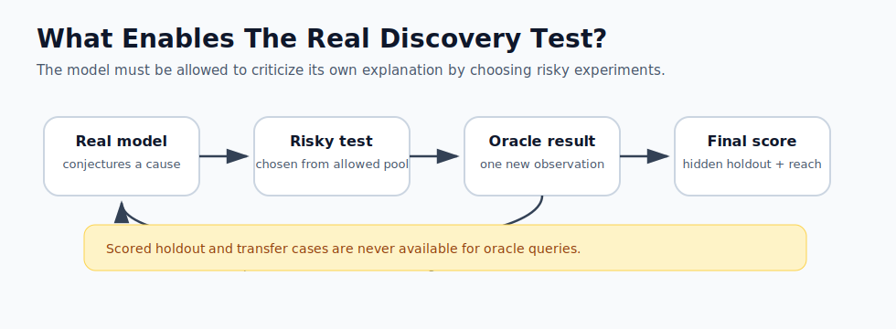

# Deutsch AI Discovery

An experimental harness for asking a narrow version of a big question:

> Can an AI-style process improve hidden-world model discovery by maintaining rival conjectures, selecting discriminating tests, and revising after oracle feedback?

The motivating example is David Deutsch's contrast between mythic explanations of seasons and the harder-to-vary explanation involving the Earth's axial tilt. This project does **not** ask an AI to rediscover Earth's seasons. That would be contaminated by prior knowledge. Instead, it creates hidden synthetic worlds after the run starts, gives agents neutral observations, lets critique agents query a sealed oracle, and scores final predictions on unseen cases.


Interactive explainer: https://abryfs.github.io/deutsch-ai-discovery/

## What This Tests

This is not a proof of open-ended AI science or Deutschian good explanations. It is a small, falsifiable process test.

The experiment can show whether an explicit critique loop helps agents:

- Maintain rival conjectures instead of collapsing immediately to one pattern.
- Ask tests where rival explanations disagree.
- Improve on hidden holdout cases.
- Transfer predictions to a structurally shifted world.

The experiment can also show failure. A seed where a simple predictor beats the critique loop is valuable evidence, not something to hide.

Safe claim:

> We test whether a Deutsch-inspired conjecture-and-criticism loop improves hidden-world model discovery versus matched baselines.

## How The Anti-Cheating Works

The benchmark avoids the obvious cheat of using known scientific facts:

- Hidden worlds are generated from runtime seeds.
- The causal rule is withheld until after scoring.
- Public, experimentable, holdout, and transfer cases are explicitly disjoint.
- Critique agents can query the oracle only from the experimentable pool.
- Opaque model-facing observations remove mythic story text and use neutral symbols only.
- Agents are compared against matched baselines with the same hypothesis library and label budget.
- Headline winners are chosen by hidden truth score, not by sounding philosophical.


## Run A Single Demo

```bash
python3 -m deutsch_ai_discovery.experiment --seed 17 --rounds 4 --opaque-public
```

This writes:

- `reports/report_seed_17.md`: readable evidence report
- `reports/transcript_seed_17.json`: structured transcript for auditing

Example console output:

```text
Deutsch-style discovery experiment complete.
Report: reports/report_seed_17.md
Transcript: reports/transcript_seed_17.json

Scores:
- matched no-critique conjecture: truth=0.755, prediction=1.000, reach=0.300, explanation=0.392
- matched passive extra observations: truth=0.755, prediction=1.000, reach=0.300, explanation=0.392
- matched random tests: truth=0.755, prediction=1.000, reach=0.300, explanation=0.392
- Deutsch critique loop: truth=0.755, prediction=1.000, reach=0.300, explanation=0.493
- myth-preserving storyteller: truth=0.498, prediction=0.550, reach=0.400, explanation=0.058
- pure prediction: truth=0.475, prediction=0.475, reach=0.475, explanation=0.386
```

Exact results vary by seed because each world is generated at runtime. This seed is not a win for the critique loop on truth score; the matched controls tie it. That is useful evidence, not a failure of the harness.

## Run A Benchmark

Single seeds are anecdotes. The stronger test is many generated worlds:

```bash
python3 -m deutsch_ai_discovery.benchmark --start-seed 1 --runs 50 --rounds 4
```

This writes:

- `reports/benchmark_1_50.md`: aggregate scores, winners, and failure cases
- `reports/benchmark_1_50.json`: structured benchmark data

The benchmark report separates:

- `avg truth`: the headline score, based on hidden prediction and transfer reach.
- `avg explanation`: diagnostic proxy score for constraint, criticizability, and error correction.
- `failure cases`: seeds where the Deutsch critique loop did not win.

The default scored set is intentionally larger than the first prototype: 40 holdout cases and 40 transfer cases per seed. Worlds, not individual cases, are the replication unit, so failure cases and variance should be read as part of the evidence. A 10-seed smoke benchmark after the pivot produced 8 failure cases, which reinforces why the project should be treated as a benchmark-design experiment rather than a success demo.

## Acceptance Protocol

Before spending serious LLM budget, treat this as the minimum protocol:

- Declare the seed list, model list, prompts, primary metric, and analysis before running.
- Primary endpoint: paired final truth score of `Deutsch critique loop` versus matched no-critique, passive-extra-observation, and random-test controls.
- Report confidence intervals or paired bootstrap intervals across worlds.
- Treat trajectory, explanation proxies, and best intermediate scores as diagnostics only.
- Count a result as supportive only if the critique loop beats matched controls across worlds, not just on one seed.
- Count a result as negative if matched controls explain the gain or if transfer does not improve.

## Run A Real Model

The next step is to replace heuristic agents with real models through an OpenRouter-compatible endpoint. If you have a GCP VM exposing OpenRouter-compatible `/chat/completions`, point the runner at it with environment variables:

```bash
export OPENROUTER_BASE_URL="https://your-vm.example.com/api/v1"
export OPENROUTER_API_KEY="your-key"
export OPENROUTER_MODEL="openai/gpt-4o-mini"

python3 -m deutsch_ai_discovery.real_model --seed 17 --opaque-public
```

This writes a real-model report and the full prompt/response transcript under `reports/`. In opaque mode, the model sees neutral case symbols and outcomes only; mythic story text is withheld. The hidden oracle scores predictions afterward.

For Gemini:

```bash
export GEMINI_API_KEY="your-key"
export GEMINI_MODEL="gemini-2.5-flash"

python3 -m deutsch_ai_discovery.real_model --provider gemini --seed 17 --opaque-public
```

Historical pre-pivot Gemini smoke run, seed `17`, `public-count=8`, `holdout-count=8`:

- One-shot Gemini: truth `0.750`
- Three-round Gemini loop: truth `0.750`

The loop successfully requested valid oracle tests, but this seed did not show an advantage over one-shot prediction. Re-run real-model results under the current opaque, matched-control protocol before treating them as evidence.

## Run The Real Critique Loop

The one-shot real-model runner is not enough to test the core claim. The multi-round loop lets the model request oracle tests before final scoring:

```bash
python3 -m deutsch_ai_discovery.real_loop --provider gemini --seed 17 --rounds 3 --opaque-public
```

The loop report now includes a score trajectory:

- round `0`: prediction score before any oracle feedback
- round `1..N`: score after each requested oracle test
- total delta from initial to final
- best score reached, reported as diagnostic only
- positive delta count and maximum consecutive positive deltas
- regression count

This asks a stronger question than `0 -> 1`: once a model improves an explanation, can it keep improving rather than merely patching one case?
The trajectory scoring calls are diagnostic only. Their prompts and scores are never fed back into later oracle-test prompts.
The headline score remains the final post-oracle score, not the best intermediate score.



## Agents Compared

The harness compares these agents:

- `myth-preserving storyteller`: keeps the story flexible and predicts the majority outcome.
- `pure prediction`: matches observed surface features without a causal explanation.
- `matched no-critique conjecture`: uses the same hypothesis library as the critique loop, but refuses risky tests.
- `matched passive extra observations`: gets the same extra label budget without active test selection.
- `matched random tests`: spends the same label budget on random experiment cases.
- `Deutsch critique loop`: keeps rival explanations alive, asks decisive tests, and revises after oracle results.

## Current Limitations

The current agents are still hand-built heuristics, not real LLM agents. The hypothesis space is still supplied by the benchmark designer. The transfer world is structurally shifted, but still a toy world with the same interface. This project currently tests the structure of a Deutsch-inspired discovery loop more than it proves autonomous AI discovery.

The real-model runner is the first bridge to LLM testing. The multi-round loop is the first implementation of the actual conjecture, criticism, oracle feedback, and revision cycle, but it still needs multi-seed and multi-model runs before making a strong claim.
