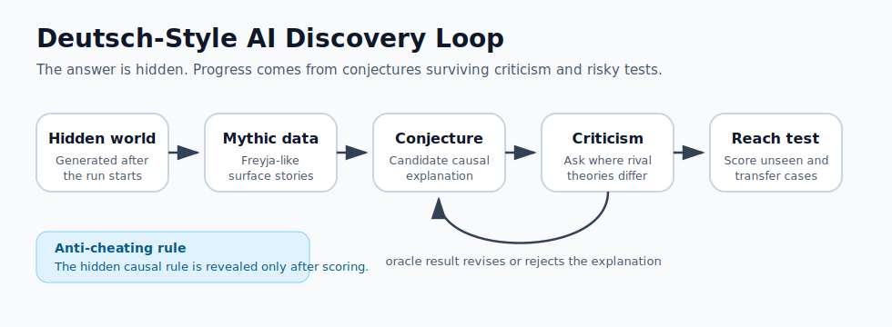
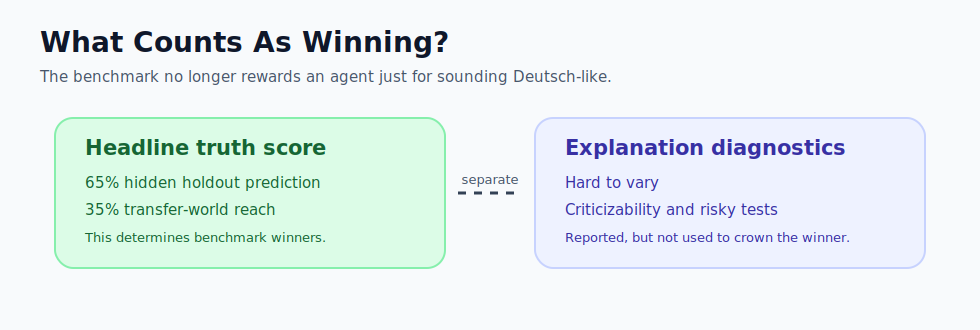

# Deutsch AI Discovery

An experimental harness for asking a narrow version of a big question:

> Can an AI-style process improve explanations by conjecture, criticism, and error correction, without simply retrieving a known answer from training data?

The motivating example is David Deutsch's contrast between mythic explanations of seasons and the harder-to-vary explanation involving the Earth's axial tilt. This project does **not** ask an AI to rediscover Earth's seasons. That would be contaminated by prior knowledge. Instead, it creates hidden synthetic worlds after the run starts, gives agents only myth-like observations, and scores them on unseen cases.



## What This Proves

This is not a proof of open-ended AI science. It is a small, falsifiable testbed.

The experiment can show whether a critique loop helps agents:

- Replace flexible stories with more constrained causal explanations.
- Ask risky tests where rival explanations disagree.
- Improve on hidden holdout cases.
- Transfer an explanation to a related but unseen world.

The experiment can also show failure. A seed where a simple predictor beats the critique loop is valuable evidence, not something to hide.

## How The Anti-Cheating Works

The benchmark avoids the obvious cheat of using known scientific facts:

- Hidden worlds are generated from runtime seeds.
- The causal rule is withheld until after scoring.
- Public observations are written as Freyja-like stories.
- Reports can use opaque variable labels instead of semantic names.
- Agents are compared against simple baselines.
- Headline winners are chosen by hidden truth score, not by sounding philosophical.



## Run A Single Demo

```bash
python3 -m deutsch_ai_discovery.experiment --seed 17 --rounds 4 --opaque-public
```

This writes:

- `reports/report_seed_17.md`: readable evidence report
- `reports/transcript_seed_17.json`: structured transcript for auditing

Example console output:

```text
Deutsch-style discovery experiment complete.
Report: reports/report_seed_17.md
Transcript: reports/transcript_seed_17.json

Scores:
- Deutsch critique loop: truth=1.000, prediction=1.000, reach=1.000, explanation=0.596
- pure prediction: truth=0.465, prediction=0.500, reach=0.400, explanation=0.386
- no-critique conjecture: truth=0.380, prediction=0.450, reach=0.250, explanation=0.325
- myth-preserving storyteller: truth=0.367, prediction=0.350, reach=0.400, explanation=0.058
```

Exact results vary by seed because each world is generated at runtime.

## Run A Benchmark

Single seeds are anecdotes. The stronger test is many generated worlds:

```bash
python3 -m deutsch_ai_discovery.benchmark --start-seed 1 --runs 50 --rounds 4
```

This writes:

- `reports/benchmark_1_50.md`: aggregate scores, winners, and failure cases
- `reports/benchmark_1_50.json`: structured benchmark data

The benchmark report separates:

- `avg truth`: the headline score, based on hidden prediction and transfer reach.
- `avg explanation`: diagnostic score for hard-to-vary structure, criticizability, and error correction.
- `failure cases`: seeds where the Deutsch critique loop did not win.

## Agents Compared

The harness compares four agents:

- `myth-preserving storyteller`: keeps the story flexible and predicts the majority outcome.
- `pure prediction`: matches observed surface features without a causal explanation.
- `no-critique conjecture`: picks the best initial conjecture but refuses risky tests.
- `Deutsch critique loop`: keeps rival explanations alive, asks decisive tests, and revises after oracle results.

## Current Limitations

The current agents are still hand-built heuristics, not real LLM agents. The hypothesis space is wider than the first version, but it is still supplied by the benchmark designer. This project currently tests the structure of a Deutsch-style discovery loop more than it proves autonomous AI discovery.

The next serious step is to connect real LLM agents to the same sealed oracle while preserving the hidden-world boundary and full prompt transcripts.
